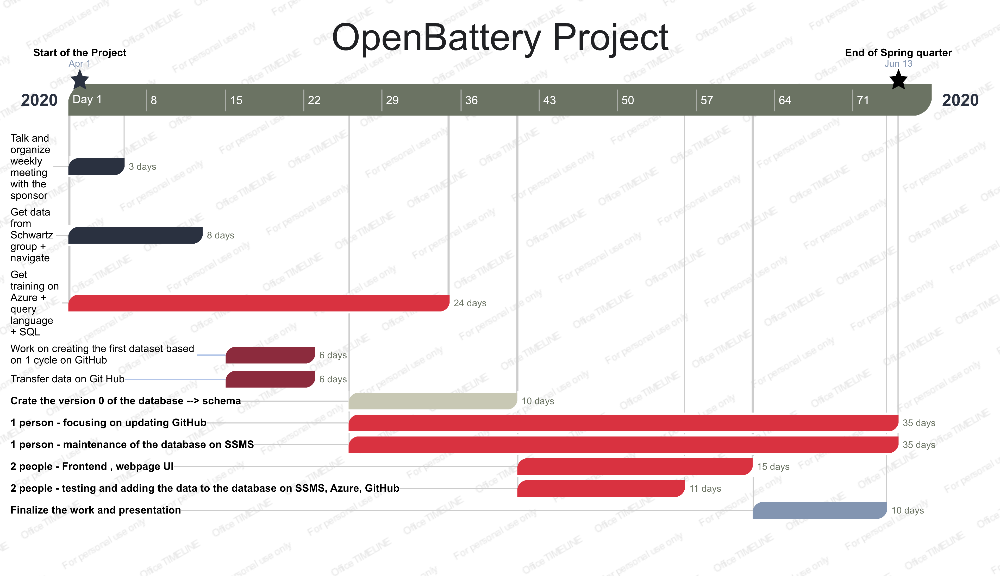
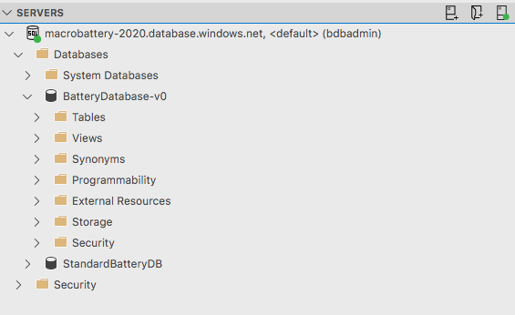
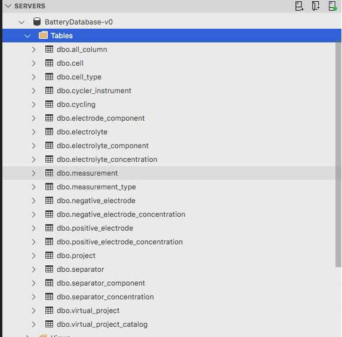
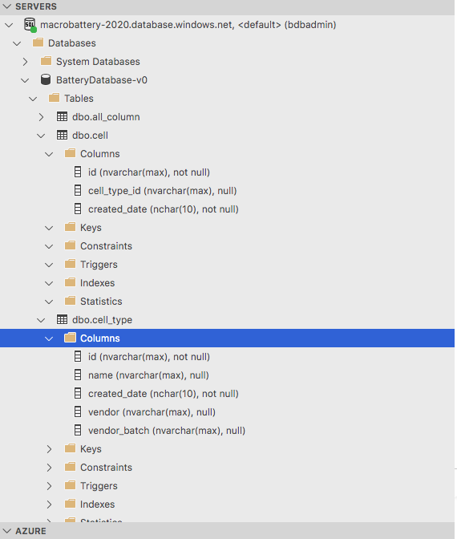
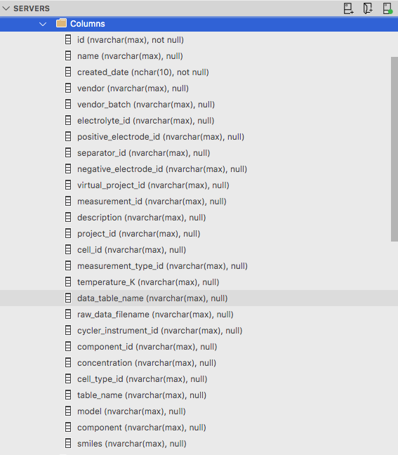

# OpenBattery                 

*Want to find the best battery for your product among all the available in the market?*                                       
*Want to compare the battery you created with all the other commerciallly available?*

OpenBattery will provide you all the information and more!

OpenBattery is a high performance open source relational database for academics and industry working with battery.
The platform is available on Microsoft Azure and users can access it to add data too!
This is a transformational resource to develop and validate machine learning and physics based models for the design, prediction, and optimization of battery performance under a wide range of use cases.

**Gantt Chart**

**SQL SERVER**

Relational databases are very useful when we want to manage structured data via schema, constraints and relationship.

We created our version zero of the schema on SQL Server Management Studio (SSMS) and Azure Data Studio from Microsoft.
These servers are used for the access, configuration, management, administration and development of all components of Azure SQL database.

SQL is a standard language for storing, manipulating and retrieving data in databases.

A database in SQL Server is made up of a collection of tables that stores a specific set of structured data. A table contains a collection of rows, also referred to as records or tuples, and columns, also referred to as attributes. Each column in the table is designed to store a certain type of information, for example, the type of electrode, electrolyte and separator of the battery.

We called our Database in SSMS/Azure Data Studio "macrobattery_database":

Inside the "macrobattery_database" we created the tables:

And inside each tables we created columns containing the specific informations of the tables:

Tables are database objects that contain all the data in a database. In tables, data is logically organized in a row-and-column format similar to a spreadsheet. Each row represents a unique record, and each column represents a field in the record. 
