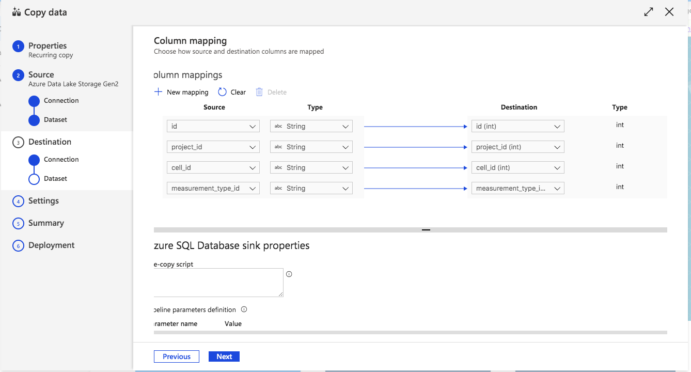

# OpenBattery                 

*Want to find the best battery for your product among all the available in the market?*                                       
*Want to compare the battery you created with all the other commerciallly available?*

OpenBattery will provide you all the information and more!

OpenBattery is a high performance open source relational database for academics and industry working with battery.
The platform is available on Microsoft Azure and users can access it to add data too!
This is a transformational resource to develop and validate machine learning and physics based models for the design, prediction, and optimization of battery performance under a wide range of use cases.

**Gantt Chart**

**SQL SERVER**

Relational databases are very useful when we want to manage structured data via schema, constraints and relationship.

Structured Query Language (SQL) is a standard language for storing, manipulating and retrieving data in databases.

A database in SQL Server is made up of a collection of tables that stores a specific set of structured data. A table contains a collection of rows, also referred to as records or tuples, and columns, also referred to as attributes. Each column in the table is designed to store a certain type of information, for example, the type of electrode, electrolyte and separator of a battery.

We created our version zero of the schema on SQL Server Management Studio (SSMS) and Azure Data Studio from Microsoft.
These servers are used for the access, configuration, management, administration and development of all components of Azure SQL database.

We called our SQL Server in SSMS/Azure Data Studio *"macrobattery-2020.database.windows.net"* and our version 0 schema *"Battery-Database-v0"*:

Inside the *"Battery-Database-v0"* we created the tables:

And inside each tables we created columns containing the specific informations of the tables:

Tables are database objects that contain all the data in a database. In tables, data is logically organized in a row-and-column format similar to a spreadsheet. Each row represents a unique record, and each column represents a field in the record. 

***N.B*** : We do not upload the data given from Schwartz group because the repo is public and they haven't been published yet.

**Azure Data Factory**

To connect the dataset with the SQL Azure Database we the Data Factory service on Azure.
Thanks to this service we were able to create a pipeline between our Azure storage account and the SQL Database.

We used the option of "Copy Data" inside  our "UWCEIMacroBattery" DataFactory:

We can choose to run the operation regularly, selecting an end date or forever:

We connected our Source dataset to our storage account and we created the connection calling it "LinkedService2":

From the Source dataset we choose the csv file that we want to transfer inside the table of the SQL Database:

The Data Factory software detect the columns and data inside the csv file:

Then, we selected our destination or "Sink" to be our SQL Azure Database and we created a connected service that we called "LinkedService3":

Then, we selected the table inside the SQL Database in which we want to import our data:

The Datafactory shows the column mapping and here you are able to check if the connections are correct and modify them:

You have the option then to decide whether to detect fault in the data stream:

After those selection, we were able to run the data transfer to the SQL Database tables:

**Azure Web App**

We want to create a User interface design Webpage with the relational database created on Azure. To do that we can use the function of *"Web App"* in the Azure cloud.

**Cost Estimation**

To estimate the cost of our Azure project, we used the <a href="https://azure.microsoft.com/it-it/pricing/calculator/">Azure Price Calculator</a> .
  
Thanks to this service, we were able to select the Azure products that we needed (Azure SQL Database, DataFactory, Storage account and Web app service). When we selected a product, we were able to select the specific features we needed and see the cost of the product changing. At the end, we exported the whole price calculation in an excel file which summarized the cost of our products selection:

It is very important to perform the cost estimation only when you have a clear idea of what you need for your project to succeed. It is important to select the products you need and start with the lower cost and lower performance features. Then, if you realize that you need more storage or usage time, you can always switch to a higher cost plan.  

Microsoft Azure is the one of biggest cloud service provider worldwide created and operated by Microsoft for building, testing, deploying and managing applications services. 

Shown as Azure Architecture can be divided into 3 main components, Front Ends, Middle Ware, Services. In specific, front ends includes Azure portal, Azure PowerShell, Azure CLI, Rest clients, which are four different ways of accessing the Azure resources. 

In specific, Azure portal is the GUI dashboard provided to users by Azure, through which we can deploy or provision resources. 

Azure PowerShell, make use of the Windows powershell to give command line access to Azure Resources. 

The Azure CLI is a command -line tool providing a great experience for managing Azure resources. The CLI is designed to make scripting easy, query data, support long-running operations and, more. 

REST clients are APIS which can be used in application’s code to initiate an action on Azure clod. 

 The Azure Resource Manager is the mediator between the resources and external agents which can interact with the azure resources, which is the Middle Ware.  Azure Resource Manager plays a key deploying and managing the azure resources. It helps to organize the resources in one group, this group is called resource group, it also help to deploy, manage and monitor all the resources for the solution as a group, rather than handling these resources individually. 

The Azure services includes but not limited in Compute, Networking, File Storage, Database, AI + Machine Learning, Identity and management. The Compute part of core Azure Services includes Azure Virtual Machines, Function App, App, Service, Azure Kubernetes Services. 

•	The Azure Virtual Machines are image service instance that provide on-demand and scalable computing resources with usage-based pricing. 
•	Azure Functions is a solution for easily running small pieces of code, or “functions,” in the cloud. You can write just code you need for the problem at hand, without worrying about the whole application or the infrastructure to run it. 
•	Azure App service is a fully managed “Platform as a Service” (PaaS) that integrates Microsoft Azure Websites, Mobile Services, and BizTalk Services into a single service. 
•	Azure Kubernetes (AKS) is a managed container orchestration service, based on the open source Kubernetes system, which is available on the Microsoft Azure public cloud

Here is a hands-on example for creating a virtual machine

After logging on to the Azure portal and direct to the Virtual machine page, we could create a VM using the following instruction. 

After creating the VM, this is the overview of the virtual machine. 

Meanwhile, we could create the website using our virtual machine IP address using Putty. Using the html, we could build our website for the virtual machine on the Putty terminal. 

Another Azure Service is Networking, in which contains 5 core azure services, Virtual Networks, Load Balancers, Application Gateway, DNS Zones, and CDN Profiles. In specific:

•	Azure Virtual Network (VNet) is a representation of your own network in the cloud. It’s a logical isolation of the Azure cloud dedicated to your subscription. Each VNet you create has its own CIDR block, and can be linked to other VNets and on-premises networks as long as the CIDR blocks do not overlap. 

•	The Load Balancers is a layer-4 (TCP, UDP) load balancer that provides high availability by distributing incoming traffic among healthy VMs. 

•	The Application Gateway is a wen traffic load balancer that enables you to manage traffic to your web applications. This type of routing is known as application layer (OSI layer 7) load balancing. 

•	DNS Zone is a data resource that contains the DNS records for a domain name. You can use Azure DNS to a DNS zone and manage the DNS records for a domain in Azure.  
•	Azure Content Delivery Network (CDN) is a global CDN solution for delivering high-bandwidth content. With Azure CDN, you can cache static objects loaded from Azure blob storage, a web application, or any publicly accessible web server, by using the closest point of presence (POP) server. 

The storage service includes blob storage, file storage, tables storage, queues storage, data lake storage, and data box storage.

•	Azure blob storage is a service for storing large amount of unstructured object data, such as binary data. Common uses of blob storage include: Serving images of documents directly to a browser. 

•	Storing files for distributed access. Streaming video and audio. Azure files offers fully managed file shares in the cloud are accessible via the industry standard Server Message Block (SMB) protocol. 

•	Azure file shares can mount concurrently by cloud or on-premises deployments of Windows, Linux, and MacOS. Azure Table Storage stores large amount of structured data. The service is a NoSQL datastore which accept the authenticated calls from inside and outside the Azure cloud. 

•	Azure tables are ideal for storing structured, non-relational data. Azure Queue storage is a service for storing large amount of message that can be accessed from anywhere in the world via authenticated calls using HTTP or HTTPS. A single queues message can be up to 64 KB in size, and a queen can contain millions of messages, up to the total capacity limit of storage account. 

•	Azure Data Lake Storage is an enterprise-wide hyperscale repository for big data analytics workloads. Azure Data Lake enables you to capture data of any size, type, and ingestion speed on one single place for operational and exploratory analytics. 

•	The Data Box can move stored or in-flight to Azure quickly and cost-effectively: Data Box offline devices easily move data to Azure when busy networks are not an option. Data Box online appliances transfer data to and form Azure over the network. 

Azure also have a core service is Database + Analytics. 

•	Azure SQL database is an intelligent, scalable. Cloud database service that provides the broadest SQL Server engine compatibility and up to 212% return on investment.

•	Azure Cosmos DB is a fully managed database service with turnkey global disturbution and transparent multi-master replication. Get single-digit millisecond read and write latencies at the 99th percentile, automatic and elastic scaling of throughput and storage. 

•	Azure Data service is a fully managed service for composing data storage, processing, and movement service into streamlined, scalable, and reliable data production pipelines.  

•	Event hubs is a fully managed, real-time data ingestion service that is simple, trusted and scalable. Stream millions of events per second from any source to build dynamic data pipelines and immediately respond to business challenges. 

•	Azure Data lake analytics is a distributed, cloud-based data processing architecture offered by Microsoft in the Azure cloud. It’s based on YARN, the same as the open-source Hadoop platform. It pairs with Azure Data Lake Store, a cloud-basedstorage platform designed for Big Data analytics. 

AI + Machine Learning 

•	Azure Cognitive Service are APIs, SDKs, and services available to help developers build intelligent applications without having direct AI or data science skills or knowledge. Azure Cognitive Service enable developers to easily add cognitive features into their applications. 

•	Azure Bot Services is Microsoft’s artificial intelligence (AI) chatbot offered as a service on the Azure cloud service marketplace. Azure Bot Service offers the ability to add intelligent agents that ate capable of conversation without having to commit the resources to develop one’s own AI.

•	Microsoft Azure Machine Learning Studio is a collaborative, drag-and-drop tool ca nuse to build, test, and deploy predictive analytics solutions on your data. Machine Learning Studio publishes models as web services that can easily be consumed by custom apps or BI tools such as Excel. 

The last core Azure Service I will introduce is Management

•	Log data collected by Azure Monitor is stored in a Log Analytics workspace, which is based on Azure Data Explorer. It collects telemetry from a variety of source and uses the Kusto query language used by Data Explorer to retrieve and analyze data. 

•	Azure Cost Management is a native Azure cost management solution. It help you to analyze costs, create and manage budgets, export data, and review and act on optimization recommendations to save money. 

•	Azure Automation delivers a cloud-based automation and configuration service that provides consistent management across your Azure and non-Azure environments. It consists of process automation, update managements, and configuration features. 

•	Metrics are available for interactive analysis in the azure portal with Metrics Explorer. They can be added to an Azure dashboard for visualization in combination with other data and used for near-real time alerting. Read more about Azure Monitor. Metrics including their sources of data in Metrics in Azure Monitors. 

